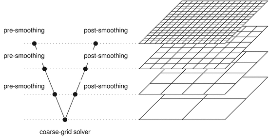
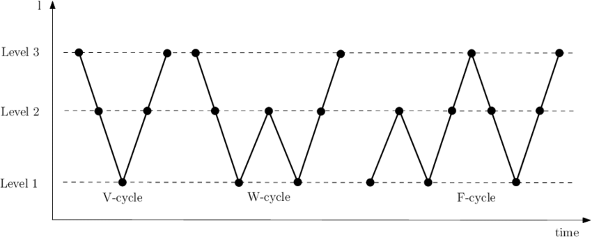
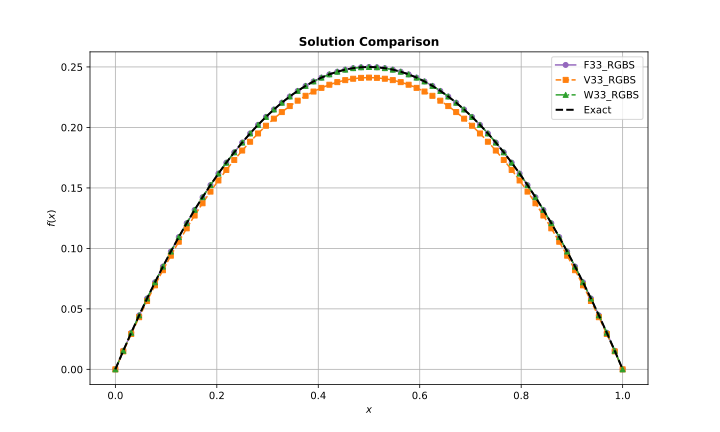
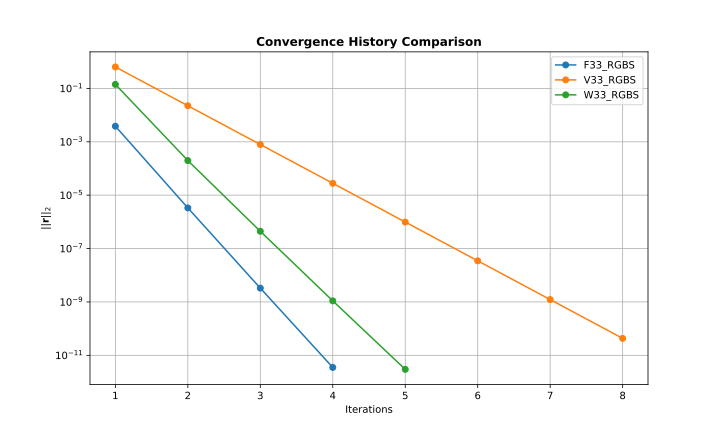

# multigrid-solver


A C++ implementation of multigrid methods for efficiently solving elliptic partial differential equations of the form:

$$-\nabla^2 u + \sigma u = f(\mathbf{x})$$

where $\sigma \geq 0$.

This equation is often called the **modified Helmholtz equation** or **screened Poisson equation** and plays a fundamental role in various scientific and engineering fields. It describes processes such as heat conduction, electrostatics, steady-state diffusion, and wave propagation. Efficient and accurate numerical solutions are crucial for large-scale simulations in computational physics, engineering analysis, and scientific computing.


Multigrid methods dramatically accelerate the solution of large linear systems arising from discretized PDEs by combining smoothing on fine grids with corrections from coarser grids, achieving rapid convergence even for challenging problems.

The book [*A Multigrid Tutorial, 2nd Edition*](https://www.researchgate.net/publication/220690328_A_Multigrid_Tutorial_2nd_Edition) by W. L. Briggs et al. was used as a major guidance in the development process of this project and serves as a widely used reference for understanding and implementing multigrid methods.

## Table of Content

- [Technical Overview](#technical-overview)
- [Key Features](#key-features)
- [Build](#build)
- [Usage](#usage)
- [Plotting Results](#plotting-results)
- [Tests](#tests)
- [Example Problem Setup](#example-problem-setup)
- [Results](#results)
- [Discussion](#discussion)
- [Conclusion](#conclusion)

## Technical Overview

Multigrid is a highly efficient numerical technique for solving large systems of linear equations that arise from the discretization of partial differential equations (PDEs). Unlike traditional iterative solvers, which can become slow for fine grids due to slow error reduction, multigrid methods address errors at multiple spatial scales by operating on a hierarchy of grids.

The core idea is to accelerate convergence by combining two complementary processes:
- **Smoothing:** Iterative methods (also called *smoothers*) are used to quickly reduce high-frequency (oscillatory) errors on each grid level.
- **Coarse-grid correction:** After smoothing, the residual (the error in the current solution) is transferred to a coarser grid, where low-frequency errors become high-frequency and can be efficiently reduced. The correction is then interpolated back to the finer grid.

A typical multigrid cycle consists of the following steps:
1. **Pre-smoothing:** Apply a few iterations of a smoother to the current solution on the fine grid.
2. **Restriction:** Compute the residual and transfer it to a coarser grid.
3. **Coarse-grid solve:** Recursively apply the multigrid process or solve directly on the coarsest grid.
4. **Prolongation (Interpolation):** Interpolate the correction from the coarse grid back to the fine grid and update the solution.
5. **Post-smoothing:** Apply additional smoothing iterations to further reduce errors.

<p align="center">
  
</p>
<p align="center"><b>Figure 1:</b> The multigrid algorithm descends through progressively coarser grids (steps 1–3), then ascends back to finer grids (steps 4–5). The path or cycle traced in the grid hierarchy for this specific example forms a "V" shape, which is why this cycle is also called a V-cycle. (Source: <a href="https://fml.wintherscoming.no/multigridsolver.php">https://fml.wintherscoming.no/multigridsolver.php</a>)</p>


Multigrid methods employ different *cycles* to control how the algorithm moves between grid levels and how frequently coarse-grid corrections are performed. Each cycle type defines a distinct pattern for descending to coarser grids and ascending back to finer grids during the solution process.

- **V-cycle:** The most common cycle, where the algorithm recursively moves down to coarser grids and then directly back up to finer grids, forming a "V" shape in a grid-level versus iteration diagram.
- **W-cycle:** Similar to the V-cycle, but with additional visits to coarser grids on the way back up, resulting in a "W" pattern. This increases computational work but can improve convergence for difficult problems.
- **F-cycle:** Begins like a V-cycle but includes extra traversals to intermediate levels, forming an "F"-shaped path. It offers a compromise between the computational cost of V- and W-cycles.


<p align="center">
  
</p>
<p align="center"><b>Figure 2:</b> Sketches of the V-cycle, W-cycle, and F-cycle in multigrid methods. Each curve shows the traversal pattern through grid levels. (Source: <a href="https://www.researchgate.net/figure/Multigrid-V-W-and-F-cycles_fig7_277720557">https://www.researchgate.net/figure/Multigrid-V-W-and-F-cycles_fig7_277720557</a>)</p>

By combining these steps, multigrid methods achieve rapid convergence rates that are often independent of the grid size, making them ideal for large-scale scientific and engineering simulations.


## Key Features

The current codebase provides a flexible and extensible framework for experimenting with multigrid methods and includes the following features:

- **1D Problem**: Solves 1D elliptic PDEs with configurable Dirichlet boundary conditions
- **Smoothers**: Supports (weighted) Jacobi, Gauss-Seidel, and Red-Black Gauss-Seidel smoothers
- **Multiple Cycle Types**: V-cycle, F-cycle, and W-cycle implementations
- **Python Plotting Utilities**: Python scripts for visualizing solutions and convergence histories
- **Flexible Configuration**: YAML-based configuration for solver parameters
- **Testing**: Comprehensive unit tests

## Build

The following dependencies are required:

- C++20 compatible compiler (GCC ≥ 11 or Clang ≥ 13)
- CMake ≥ 3.28.3
- yaml-cpp (YAML parser for C++)
- GoogleTest (included as a submodule for unit testing)

Install the required packages on Ubuntu:

```sh
sudo apt update
sudo apt install clang cmake libyaml-cpp-dev
```

To build the project:


1. Clone the repository (with submodules):

```sh
git clone --recursive git@github.com:frederic-hallein/multigrid-solver.git
cd multigrid-solver
```

If you already cloned without `--recursive`, initialize submodules with:

```sh
git submodule update --init --recursive
```

2. Create a build directory and configure the project:

```sh
mkdir build && cd build
cmake -DCMAKE_BUILD_TYPE=Release ..
```

3. Build the main executable and tests:

```sh
cmake --build .
```


## Usage

Solver parameters and problem setup are specified in `config.yaml`. Example:

```yaml
grid:
  sub_intervals: 64        # Number of sub-intervals (grid points = sub_intervals + 1)

solver:
  num_iterations: 100      # Maximum number of multigrid iterations
  tolerance: 1.0e-10       # Convergence tolerance for the residual norm
  smoother: RBGS           # Smoother type: J (Jacobi), GS (Gauss-Seidel), RBGS (Red-Black Gauss-Seidel)
  cycle: W                 # Cycle type: V, W, or F
  norm: L2                 # Norm for residual calculation: L2 or LINF
  omega: 0.667             # Weight parameter (used for weighted smoothers)

smoother:
  pre_iterations: 3        # Number of pre-smoothing steps per cycle
  post_iterations: 3       # Number of post-smoothing steps per cycle
```


To run the solver:

```sh
./main
```

## Plotting Results

Python utilities are provided for result visualization.

1. Create a virtual environment and activate it:

```sh
cd plotting
python3 -m venv .venv
source .venv/bin/activate
```

2. Install the required packages:

```sh
pip install -r requirements.txt
```

3. Generate the plots:

```sh
python3 main.py
```

Plots are saved in the `plots/` directory.


## Tests

All tests use the GoogleTest framework. Unit tests are built automatically and placed in the `\test` folder. To run all tests:

```sh
ctest
```

Or run individual test binaries directly:

```sh
./test/test_<functionality>
```


## Example Problem Setup

To demonstrate the solver, we consider a simple 1D Poisson problem (a special case of the modified Helmholtz equation):

$$
-\frac{d^2u}{dx^2} = 2 \qquad (\sigma = 0)
$$

on the domain $x \in [0, 1]$ with homogeneous Dirichlet boundary conditions:

$$
u(0) = u(1) = 0
$$

We start the iteration with initial guess:

$$u_{\text{guess}}(x) = 0$$

The exact solution for this setup is:

$$
u_{\text{exact}}(x) = x(1 - x)
$$

We run the multigrid for all three cycles (V, F, and W) using the weighted Red-Black Gauss-Seidel smoother (3 iterations pre- and post-smoothing) with weight parameter $\omega = 2/3$. This setup uses a grid with 64 sub-intervals (grid spacing $h = 1/64$), the $L_2$ norm for the resiual calculation, a maximum of 100 iterations, and a convergence tolerance of $1 \times 10^{-10}$.


## Results

The project includes data in the `example/` folder with results from different multigrid cycle types (V, W, F cycles) using the RGBS smoother. Comparison plots are already generated and saved in the `plots/example/` directory, overlaying convergence histories and solutions across different cycles. The plots are illustrated below:

<p align="center">
  
</p>
<p align="center"><b>Figure 3:</b> The plot shows the numerical solutions obtained using the V, F, and W cycles alongside the exact solution. The V-cycle result (V33_RGBS) does not converge as closely to the exact solution in x = 0.5 compared to the F and W cycles. Both the F and W cycle solutions perfectly overlap with the exact solution, demonstrating superior convergence for this problem setup. </p>

<p align="center">
  
</p>
<p align="center"><b>Figure 4:</b> This plot shows the L2 norm of the residual (on a logarithmic scale) versus iteration number for each cycle type. The V-cycle (V33_RGBS) requires almost twice as many iterations to converge compared to the F and W cycles, with the F-cycle achieving convergence in the fewest steps — only 4 iterations. </p>

<div align="center">

<table>
  <thead>
    <tr>
      <th>Cycle Type</th>
      <th>Iterations</th>
      <th>Time (ms)</th>
    </tr>
  </thead>
  <tbody>
    <tr>
      <td>V</td>
      <td>8</td>
      <td>0.037</td>
    </tr>
    <tr>
      <td>W</td>
      <td>5</td>
      <td>0.1</td>
    </tr>
    <tr>
      <td>F</td>
      <td>4</td>
      <td>0.047</td>
    </tr>
  </tbody>
</table>

<b>Table 1:</b> Comparison of multigrid cycle types. The F-cycle converges fastest for this problem, while the V-cycle requires the most iterations.
</div>

**Note**: To regenerate these plots, uncomment `plot_example(u_exact)` in `plotting/main.py` and run the python script again.

## Discussion

The results show that all three multigrid cycles (V, W, and F) successfully solve the 1D Poisson problem, with the F-cycle converging in the fewest iterations and the V-cycle requiring the most. This behavior is expected, as the F- and W-cycles perform additional coarse-grid corrections, which can accelerate convergence for certain problems. The numerical solutions closely match the exact solution, indicating that the implementation works as intended for this simple test case.

However, to fully assess the robustness and reliability of the solver, it should be tested on more challenging and non-trivial problems, such as equations with variable coefficients, more complex source terms, or irregular domains. Additional validation is also recommended for cases with slower convergence or potential numerical instability.

Possible extensions to the codebase include supporting other boundary conditions (e.g., Neumann) and extending the solver to handle 2D problems in various coordinate systems, such as Cartesian and polar coordinates. These enhancements would broaden the applicability of the solver to a wider range of scientific and engineering problems.

## Conclusion

This project demonstrates that multigrid methods are highly effective for solving 1D elliptic PDEs, achieving rapid convergence even for fine grids. The implementation works as intended for the tested example, and the results highlight the advantages of different cycle types. Future work should focus on extending the solver to more complex problems and higher dimensions to further validate its robustness and broaden its applicability.
